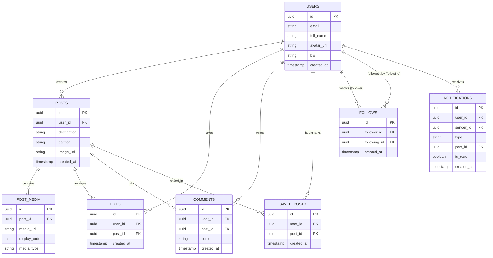
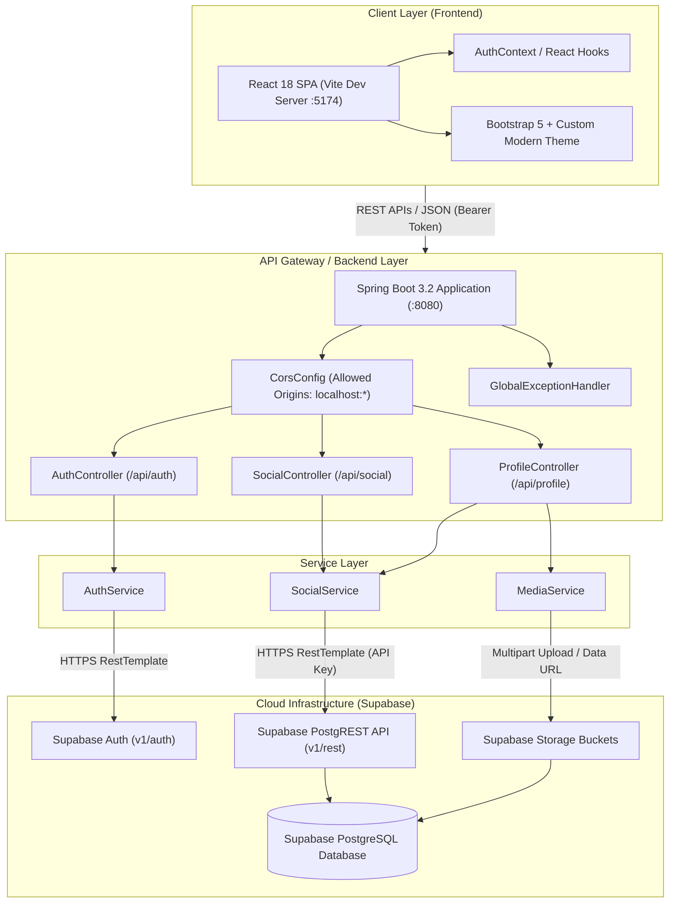
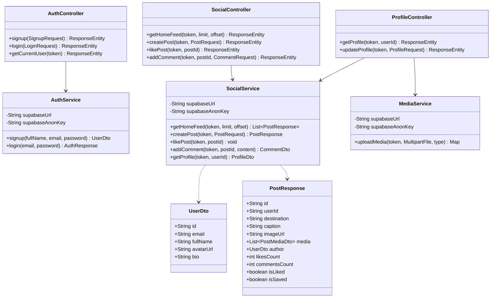

# TripNest 2.0 — Problem Statement & Technical Architecture

---

## 1. Title
**TripNest 2.0 — High-Performance Social Travel & Experience Discovery Platform**

---

## 2. Domain
**Social Media / Travel & Tourism / Experience Sharing**

---

## 3. Who is the User?
1. **Traveler / Content Creator (Standard User)**:
   - **Role**: Shares travel moments, photos, and stories; explores global destinations; engages with fellow travelers via likes, comments, and saves; manages profile and followings.
2. **Travel Explorer (Casual Reader)**:
   - **Role**: Discovers trending destinations, reads real traveler reviews and tips, searches location-based posts, and bookmarks favorite moments for future trips.
3. **Platform Moderator / Admin (Administrative Role)**:
   - **Role**: Monitors community content, manages platform security and CORS permissions, oversees database integrity, and moderates reported posts/accounts.

---

## 4. What Problem Are We Solving?
Modern travel planning is fragmented across text-heavy blogs and cluttered review sites, making it difficult for travelers to discover authentic, visually compelling destination experiences. Traditional social platforms crop images indiscriminately, stripping away full vertical and landscape photography details captured on modern smartphones. Furthermore, users lack a dedicated space where destination posts, traveler interactions, saved travel itineraries, and direct traveler networking exist seamlessly in one place. TripNest 2.0 solves this by providing a dedicated, uncropped visual social discovery platform tailored specifically for travel enthusiasts.

*Real-Life Example*: A user traveling through Oia, Santorini captures full portrait sunset photos. On conventional apps, the top and bottom of the caldera photo get cropped out. On TripNest 2.0, the full portrait image is preserved with soft ambient backdrops, allowing followers to see the complete destination experience while bookmarking the exact location for their upcoming trip.

---

## 5. Proposed Solution
TripNest 2.0 is a full-stack Web Application built using **React 18** and **Spring Boot 3.2** powered by **Supabase PostgreSQL**.

### Key Features:
- **Authentication & Security**: Email/password authentication, JWT bearer token verification, and session persistence.
- **Uncropped Visual Feed**: Dynamic layout supporting 100% full portrait, landscape, and square photo displays without cropping, enhanced with soft ambient blur backdrops.
- **Multi-Photo Carousels**: Capability to post up to 10 photos per travel moment with custom ordering.
- **Social Engagement Engine**: Real-time likes with double-tap heart animations, nested comments, and bookmarking/saving posts.
- **Traveler Network & Profiles**: User profiles featuring full bios, customizable avatars, follower/following counts, and individual photo galleries.
- **Destination & Traveler Search**: Location-based filtering and global search for destinations and travelers.
- **Notification System**: Automated activity notifications for new likes, comments, and followers.

---

## 6. Core Entities / Database Tables
The application relies on 8 core relational entities:

1. **`users` (Profiles)**: Stores user account info (`id`, `email`, `full_name`, `avatar_url`, `bio`, `created_at`).
2. **`posts`**: Stores travel posts (`id`, `user_id`, `destination`, `caption`, `image_url`, `created_at`).
3. **`post_media`**: Stores multi-image attachments per post (`id`, `post_id`, `media_url`, `display_order`, `media_type`).
4. **`likes`**: Tracks post likes (`id`, `user_id`, `post_id`, `created_at`).
5. **`comments`**: Stores user comments on posts (`id`, `user_id`, `post_id`, `content`, `created_at`).
6. **`saved_posts`**: Tracks bookmarked posts (`id`, `user_id`, `post_id`, `created_at`).
7. **`follows`**: Tracks user follow relationships (`id`, `follower_id`, `following_id`, `created_at`).
8. **`notifications`**: Stores activity alerts (`id`, `user_id`, `sender_id`, `type`, `post_id`, `is_read`, `created_at`).

---

## 7. User Roles & Permissions

| Role | Access Permissions |
| :--- | :--- |
| **Traveler (Standard User)** | Can create, edit, and delete their own posts; can like, save, comment on any post; can follow/unfollow users; can update their own profile and upload avatars. |
| **Admin / Moderator** | Has full read/delete access across all posts and comments; can manage CORS rules and system configuration; can purge invalid data and review platform metrics. |

---

## 8. Success Criteria
- **Performance**: Home feed and user profile pages load in **under 1.5 seconds**.
- **User Engagement**: A traveler can publish a multi-image post with location and caption in **under 30 seconds**.
- **Media Fidelity**: 100% of uploaded vertical and horizontal photos are rendered in full aspect ratio without cropping.
- **System Stability**: Zero CORS failures and 100% clean linter/build status (`0 errors, 0 warnings`).

---

## 9. Out of Scope
- Real-time flight or hotel booking payment gateway integrations (handled by 3rd-party referral links).
- Native video transcoding engine (limited to image formats: JPG, PNG, WEBP).
- In-app direct peer-to-peer messaging (reserved for Phase 3 roadmap).

---

## 10. Chosen Track
**Java Track: Spring Boot 3.2 + Java 17 + React 18 (Vite)**

---

## 📊 System Diagrams

### 1. Entity-Relationship (ER) Diagram

---

### 2. System Architecture Diagram

---

### 3. Class Diagram

