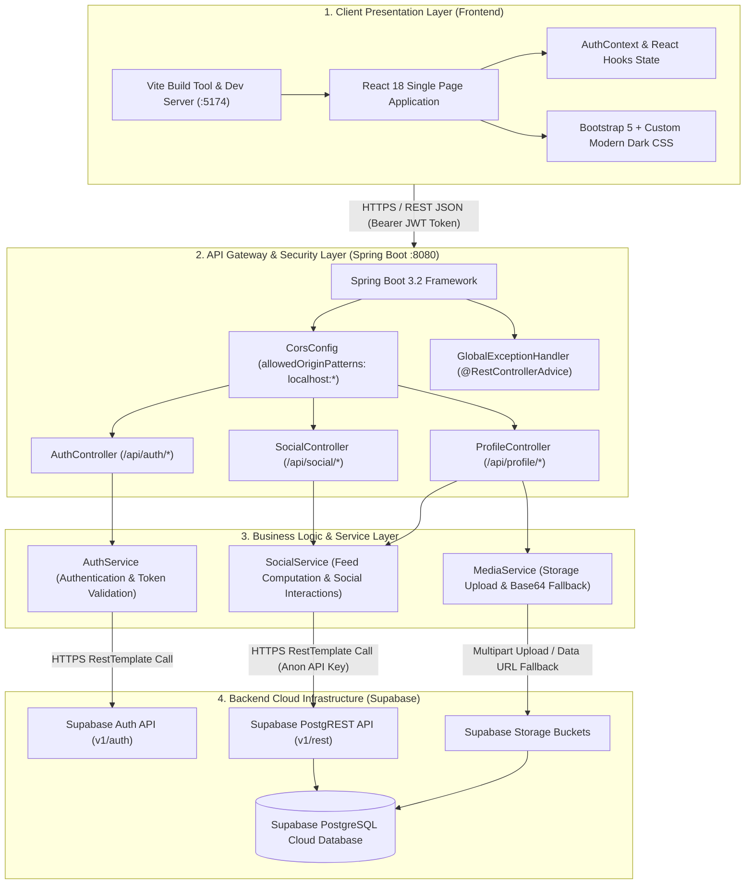

# TripNest 2.0 — System Architecture Diagram

This document illustrates the end-to-end multi-tier system architecture for **TripNest 2.0**.

---

## 🏛️ System Architecture Diagram

---

## 🔍 Architecture Component Breakdown

### 1. Presentation Layer (Frontend)
- Built with **React 18** and **Vite** for fast HMR (Hot Module Replacement).
- **`AuthContext`**: Manages global user authentication state and session token persistence in `localStorage`.
- **Responsive Layouts**: Designed with Bootstrap 5 and custom CSS to support desktop and mobile viewports seamlessly.

### 2. API Gateway & Controller Layer (Spring Boot Backend)
- **Spring Boot 3.2** running on Java 17.
- **`CorsConfig`**: Dynamically enables CORS for any local development origin (`http://localhost:*` & `http://127.0.0.1:*`).
- **`GlobalExceptionHandler`**: Intercepts `RuntimeException`, `UnauthorizedException`, and `MethodArgumentNotValidException` to return consistent JSON error responses.

### 3. Business Service Layer
- **`AuthService`**: Proxies authentication requests to Supabase Auth API (`POST /auth/v1/signup`, `POST /auth/v1/token`).
- **`SocialService`**: Orchestrates feed aggregation, pagination, post creation, likes, bookmarks, and user search via Supabase PostgREST endpoints.
- **`MediaService`**: Handles multipart file validation (max 10MB JPG/PNG/WEBP) and fallback encoding.

### 4. Cloud Infrastructure Layer (Supabase)
- **PostgreSQL Database**: Relational database managing user profiles, posts, media links, likes, comments, saved posts, follows, and notifications.
- **Supabase Storage**: Bucket storage for user avatars and post images.
