# TripNest 2.0 — Class Diagram

This document illustrates the object-oriented structure, controllers, services, DTOs, and exception handlers in **TripNest 2.0 Backend**.

---

## 📐 Class Diagram

```mermaid
classDiagram
    class AuthController {
        -AuthService authService
        +signup(SignupRequest request) ResponseEntity~AuthResponse~
        +login(LoginRequest request) ResponseEntity~AuthResponse~
        +getCurrentUser(String authHeader) ResponseEntity~UserDto~
    }

    class SocialController {
        -SocialService socialService
        +getHomeFeed(String token, int limit, int offset) ResponseEntity~List~PostResponse~~
        +getFollowingFeed(String token, int limit, int offset) ResponseEntity~List~PostResponse~~
        +createPost(String token, PostRequest request) ResponseEntity~PostResponse~
        +likePost(String token, String postId) ResponseEntity~Void~
        +unlikePost(String token, String postId) ResponseEntity~Void~
        +addComment(String token, String postId, CommentRequest request) ResponseEntity~CommentDto~
        +savePost(String token, String postId) ResponseEntity~Void~
        +unsavePost(String token, String postId) ResponseEntity~Void~
    }

    class ProfileController {
        -SocialService socialService
        -MediaService mediaService
        +getProfile(String token, String userId) ResponseEntity~ProfileDto~
        +updateProfile(String token, ProfileUpdateRequest request) ResponseEntity~ProfileDto~
        +uploadMedia(String token, MultipartFile file, String type) ResponseEntity~Map~
    }

    class AuthService {
        -String supabaseUrl
        -String supabaseAnonKey
        -RestTemplate restTemplate
        -ObjectMapper objectMapper
        +init() void
        +signup(String fullName, String email, String password) UserDto
        +login(String email, String password) AuthResponse
        +getCurrentUser(String token) UserDto
    }

    class SocialService {
        -String supabaseUrl
        -String supabaseAnonKey
        -AuthService authService
        -RestTemplate restTemplate
        -ObjectMapper objectMapper
        +init() void
        +getHomeFeed(String token, int limit, int offset) List~PostResponse~
        +getFollowingFeed(String token, int limit, int offset) List~PostResponse~
        +createPost(String token, PostRequest request) PostResponse
        +likePost(String token, String postId) void
        +unlikePost(String token, String postId) void
        +addComment(String token, String postId, String content) CommentDto
        +savePost(String token, String postId) void
        +unsavePost(String token, String postId) void
        +getProfile(String token, String userId) ProfileDto
    }

    class MediaService {
        -String supabaseUrl
        -String supabaseAnonKey
        -RestTemplate restTemplate
        +init() void
        +uploadMedia(String token, MultipartFile file, String type) Map~String, Object~
        -ensureBucketExists(String bucketName) void
    }

    class CorsConfig {
        +corsConfigurer() WebMvcConfigurer
    }

    class GlobalExceptionHandler {
        +handleValidationExceptions(MethodArgumentNotValidException ex) ResponseEntity~ErrorResponse~
        +handleUnauthorizedException(UnauthorizedException ex) ResponseEntity~ErrorResponse~
        +handleForbiddenException(ForbiddenException ex) ResponseEntity~ErrorResponse~
        +handleResourceNotFoundException(ResourceNotFoundException ex) ResponseEntity~ErrorResponse~
        +handleRuntimeException(RuntimeException ex) ResponseEntity~ErrorResponse~
        +handleGeneralException(Exception ex) ResponseEntity~ErrorResponse~
    }

    class UserDto {
        -String id
        -String email
        -String fullName
        -String avatarUrl
        -String bio
        +getId() String
        +getEmail() String
        +getFullName() String
        +getAvatarUrl() String
        +getBio() String
    }

    class PostResponse {
        -String id
        -String userId
        -String destination
        -String caption
        -String imageUrl
        -List~PostMediaDto~ media
        -UserDto author
        -int likesCount
        -int commentsCount
        -boolean isLiked
        -boolean isSaved
        -String createdAt
    }

    class PostMediaDto {
        -String id
        -String postId
        -String mediaUrl
        -int displayOrder
        -String mediaType
    }

    class CommentDto {
        -String id
        -String postId
        -String userId
        -String content
        -UserDto author
        -String createdAt
    }

    class ProfileDto {
        -String id
        -String email
        -String fullName
        -String avatarUrl
        -String bio
        -int postsCount
        -int followersCount
        -int followingCount
        -boolean isFollowing
    }

    AuthController --> AuthService
    SocialController --> SocialService
    ProfileController --> SocialService
    ProfileController --> MediaService
    SocialService --> AuthService
    SocialService ..> PostResponse
    SocialService ..> CommentDto
    SocialService ..> ProfileDto
    PostResponse "1" *-- "0..*" PostMediaDto : contains
    PostResponse "1" o-- "1" UserDto : author
    CommentDto "1" o-- "1" UserDto : author
```

---

## 💡 Class Architecture Highlights
- **Controller Layer**: Exposes stateless REST endpoints mapped to `/api/*`.
- **Service Layer**: Implements business rules, PostgREST query building, authentication token validation, and storage fallback handling.
- **DTO Package**: Data Transfer Objects (`UserDto`, `PostResponse`, `PostMediaDto`, `CommentDto`, `ProfileDto`, `AuthResponse`) decouple database representations from external JSON payloads.
- **Global Error Handling**: Intercepts all runtime and validation exceptions cleanly.
