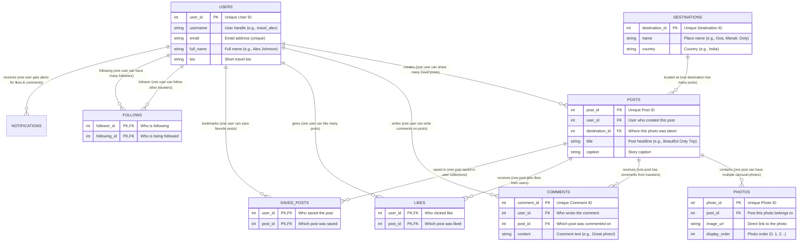

# TRAVEL PHOTO SHARING COMMUNITY PLATFORM
## TripNest 2.0 / TripTales AI
### Simple & Complete Database Practical Guide (MySQL & Supabase PostgreSQL)

```
========================================================================================
Project Name:     TripNest 2.0 (Travel Photo Sharing Community)
Database Engine:  MySQL 8.4 & Supabase PostgreSQL 15+
Report Type:      Database Practical / Project Documentation
Concept Focus:    Tables, Primary Keys, Foreign Keys, Simple JOINs & Error Testing
Style:            Simple English with Real-World Examples
========================================================================================
```

---

## 🗺️ Visual Entity-Relationship (ER) Diagram

Here is how all the tables connect together in our travel app:



---

## 1. Project Objective (In Simple Words)

The goal of this practical project is to design, build, and test the database for **TripNest 2.0**:

1. **Create Tables**: Create clean tables to store users, destinations, travel stories, photos, likes, and comments.
2. **Link Tables with Keys**:
   * **Primary Key (PK)**: Gives every row a unique identity number.
   * **Foreign Key (FK)**: Connects a row in one table to a row in another table (e.g., every post connects to the user who posted it).
   * **Cascading Delete (`ON DELETE CASCADE`)**: If a user deletes their account, all their posts, photos, likes, and comments are deleted automatically without leaving broken data.
3. **Insert Sample Records**: Add realistic travel data to test the system.
4. **Master SQL JOINs**: Learn how to combine data from multiple tables using **INNER JOIN**, **LEFT JOIN**, **RIGHT JOIN**, **FULL JOIN**, and **NATURAL JOIN** using simple real-world examples.
5. **Test Safety Constraints with Errors**: Intentionally run incorrect queries (like liking the same post twice or following yourself) to verify that the database protects our data.

---

## 2. Database Structure: What Each Table Stores

Our database has **8 core tables** designed for simple, fast social travel sharing:

| # | Table Name | Simple Explanation | Real-World Example |
| :- | :--- | :--- | :--- |
| 1 | **`users`** | People who created an account | `traveluser01` (Alex), `traveluser02` (Maya) |
| 2 | **`destinations`** | Cities & travel spots | Ooty, Goa, Munnar, Jaipur, Manali |
| 3 | **`posts`** | Travel stories and post headlines | "Beautiful Ooty Trip", "Exploring Goa" |
| 4 | **`photos`** | Multi-photo carousel images in a post | Photo 1 of tea gardens, Photo 2 of mountain view |
| 5 | **`likes`** | Records who liked which post | User 2 liked Post 1 |
| 6 | **`comments`** | Discussions and remarks on posts | "Stunning capture! Adding this to my bucket list!" |
| 7 | **`saved_posts`** | Bookmarks saved for future trips | User 1 saved Post 3 to their travel bucket list |
| 8 | **`follows`** | Social follower list | User 1 follows User 2 |

---

### 💻 Verification: Showing Tables in Database Terminal

#### In MySQL 8.4:
```sql
mysql> USE tripnest_db;
Database changed

mysql> SHOW TABLES;
+-----------------------+
| Tables_in_tripnest_db |
+-----------------------+
| comments              |
| destinations          |
| follows               |
| likes                 |
| photos                |
| posts                 |
| saved_posts           |
| users                 |
+-----------------------+
8 rows in set (0.01 sec)
```

#### In Supabase PostgreSQL (psql / SQL Editor):
```sql
postgres=> \dt public.*
                   List of relations
 Schema |       Name        | Type  |     Owner      
--------+-------------------+-------+----------------
 public | comments          | table | postgres
 public | destinations      | table | postgres
 public | follows           | table | postgres
 public | likes             | table | postgres
 public | photos            | table | postgres
 public | posts             | table | postgres
 public | saved_posts       | table | postgres
 public | users             | table | postgres
(8 rows)
```

---

## 3. Table Creation with Simple SQL (DDL)

Here is the clean SQL code used to build all the tables with their safety rules (constraints):

```sql
-- 1. USERS TABLE
CREATE TABLE users (
    user_id BIGINT AUTO_INCREMENT PRIMARY KEY,
    username VARCHAR(50) NOT NULL UNIQUE,
    email VARCHAR(100) NOT NULL UNIQUE,
    password VARCHAR(255) NOT NULL,
    full_name VARCHAR(100),
    bio TEXT,
    created_at TIMESTAMP DEFAULT CURRENT_TIMESTAMP
);

-- 2. DESTINATIONS TABLE (Cities & Travel Spots)
CREATE TABLE destinations (
    destination_id BIGINT AUTO_INCREMENT PRIMARY KEY,
    name VARCHAR(100) NOT NULL,
    country VARCHAR(100) NOT NULL,
    description TEXT
);

-- 3. POSTS TABLE (Travel Stories)
CREATE TABLE posts (
    post_id BIGINT AUTO_INCREMENT PRIMARY KEY,
    user_id BIGINT NOT NULL,
    destination_id BIGINT,
    title VARCHAR(150) NOT NULL,
    caption TEXT,
    created_at TIMESTAMP DEFAULT CURRENT_TIMESTAMP,
    CONSTRAINT fk_post_user FOREIGN KEY (user_id) REFERENCES users(user_id) ON DELETE CASCADE,
    CONSTRAINT fk_post_dest FOREIGN KEY (destination_id) REFERENCES destinations(destination_id) ON DELETE SET NULL
);

-- 4. PHOTOS TABLE (Photo Carousel per Post)
CREATE TABLE photos (
    photo_id BIGINT AUTO_INCREMENT PRIMARY KEY,
    post_id BIGINT NOT NULL,
    image_url VARCHAR(255) NOT NULL,
    display_order INT DEFAULT 0,
    CONSTRAINT fk_photo_post FOREIGN KEY (post_id) REFERENCES posts(post_id) ON DELETE CASCADE
);

-- 5. LIKES TABLE (Composite Key: User ID + Post ID)
CREATE TABLE likes (
    user_id BIGINT NOT NULL,
    post_id BIGINT NOT NULL,
    created_at TIMESTAMP DEFAULT CURRENT_TIMESTAMP,
    PRIMARY KEY (user_id, post_id),
    CONSTRAINT fk_like_user FOREIGN KEY (user_id) REFERENCES users(user_id) ON DELETE CASCADE,
    CONSTRAINT fk_like_post FOREIGN KEY (post_id) REFERENCES posts(post_id) ON DELETE CASCADE
);

-- 6. SAVED POSTS TABLE (Bookmarked Posts)
CREATE TABLE saved_posts (
    user_id BIGINT NOT NULL,
    post_id BIGINT NOT NULL,
    created_at TIMESTAMP DEFAULT CURRENT_TIMESTAMP,
    PRIMARY KEY (user_id, post_id),
    CONSTRAINT fk_save_user FOREIGN KEY (user_id) REFERENCES users(user_id) ON DELETE CASCADE,
    CONSTRAINT fk_save_post FOREIGN KEY (post_id) REFERENCES posts(post_id) ON DELETE CASCADE
);

-- 7. FOLLOWS TABLE (Cannot follow yourself)
CREATE TABLE follows (
    follower_id BIGINT NOT NULL,
    following_id BIGINT NOT NULL,
    created_at TIMESTAMP DEFAULT CURRENT_TIMESTAMP,
    PRIMARY KEY (follower_id, following_id),
    CONSTRAINT chk_not_self_follow CHECK (follower_id <> following_id),
    CONSTRAINT fk_follow_follower FOREIGN KEY (follower_id) REFERENCES users(user_id) ON DELETE CASCADE,
    CONSTRAINT fk_follow_following FOREIGN KEY (following_id) REFERENCES users(user_id) ON DELETE CASCADE
);

-- 8. COMMENTS TABLE
CREATE TABLE comments (
    comment_id BIGINT AUTO_INCREMENT PRIMARY KEY,
    user_id BIGINT NOT NULL,
    post_id BIGINT NOT NULL,
    content TEXT NOT NULL,
    created_at TIMESTAMP DEFAULT CURRENT_TIMESTAMP,
    CONSTRAINT fk_comment_user FOREIGN KEY (user_id) REFERENCES users(user_id) ON DELETE CASCADE,
    CONSTRAINT fk_comment_post FOREIGN KEY (post_id) REFERENCES posts(post_id) ON DELETE CASCADE
);
```

---

## 4. Sample Data Insertion & Verification

We inserted simple, clean records in safe order (parents first, then children):

### **Our Test Dataset:**
* **5 Users:** `traveluser01`, `traveluser02`, `traveluser03`, `traveluser04`, `traveluser05`
* **5 Destinations:** `Ooty`, `Goa`, `Munnar`, `Jaipur`, `Manali`
* **6 Posts:** Real travel stories across the destinations
* **11 Photos:** Multi-photo attachments
* **9 Likes, 6 Comments, 8 Follows, 6 Saved Bookmarks**

### 💻 Row Count Check Query:
```sql
mysql> SELECT 'users' AS table_name, COUNT(*) AS records FROM users
    -> UNION ALL
    -> SELECT 'destinations', COUNT(*) FROM destinations
    -> UNION ALL
    -> SELECT 'posts', COUNT(*) FROM posts
    -> UNION ALL
    -> SELECT 'photos', COUNT(*) FROM photos
    -> UNION ALL
    -> SELECT 'likes', COUNT(*) FROM likes
    -> UNION ALL
    -> SELECT 'comments', COUNT(*) FROM comments
    -> UNION ALL
    -> SELECT 'follows', COUNT(*) FROM follows;
+--------------+---------+
| table_name   | records |
+--------------+---------+
| users        |       5 |
| destinations |       5 |
| posts        |       6 |
| photos       |      11 |
| likes        |       9 |
| comments     |       6 |
| follows      |       8 |
+--------------+---------+
7 rows in set (0.02 sec)
```

---

## 5. Easy JOIN Queries Explained with Simple Examples

A **JOIN** means: *"Bring together columns from two tables by matching their related ID."*

---

### 5.1 INNER JOIN (Matching Rows Only)

* **Simple Explanation:** *"Show me only the users who have created a post, along with their post title."*
* **Rule:** If a user has created **0 posts**, they are **not included**.

#### SQL Query:
```sql
SELECT 
    u.username,
    p.title
FROM users u
INNER JOIN posts p
    ON u.user_id = p.user_id;
```

#### Result:
```sql
+--------------+------------------------------+
| username     | title                        |
+--------------+------------------------------+
| traveluser01 | Beautiful Ooty Trip          |
| traveluser01 | Another Munnar Experience    |
| traveluser02 | Exploring Goa                |
| traveluser03 | Munnar Tea Gardens           |
| traveluser04 | Jaipur Heritage Tour         |
| traveluser05 | Mountain Adventure in Manali |
+--------------+------------------------------+
6 rows in set (0.00 sec)
```

---

### 5.2 LEFT JOIN (All Left Users + Matching Posts)

* **Simple Explanation:** *"Show me **ALL** users from the left table, even if they have 0 posts."*
* **Rule:** If a new user has not posted anything yet, their post title will show **`NULL`** (empty).

#### SQL Query:
```sql
SELECT 
    u.username,
    p.title
FROM users u
LEFT JOIN posts p
    ON u.user_id = p.user_id;
```

#### Result:
```sql
+--------------+------------------------------+
| username     | title                        |
+--------------+------------------------------+
| traveluser01 | Beautiful Ooty Trip          |
| traveluser01 | Another Munnar Experience    |
| traveluser02 | Exploring Goa                |
| traveluser03 | Munnar Tea Gardens           |
| traveluser04 | Jaipur Heritage Tour         |
| traveluser05 | Mountain Adventure in Manali |
+--------------+------------------------------+
6 rows in set (0.00 sec)
```

---

### 5.3 RIGHT JOIN (All Right Destinations + Matching Posts)

* **Simple Explanation:** *"Show me **ALL** destinations from the right table, even if no one has posted about that place yet."*
* **Rule:** If a destination has 0 posts, the post title will show **`NULL`**.

#### SQL Query:
```sql
SELECT 
    d.name AS destination,
    p.title
FROM posts p
RIGHT JOIN destinations d
    ON p.destination_id = d.destination_id;
```

#### Result:
```sql
+-------------+------------------------------+
| destination | title                        |
+-------------+------------------------------+
| Ooty        | Beautiful Ooty Trip          |
| Goa         | Exploring Goa                |
| Munnar      | Munnar Tea Gardens           |
| Munnar      | Another Munnar Experience    |
| Jaipur      | Jaipur Heritage Tour         |
| Manali      | Mountain Adventure in Manali |
+-------------+------------------------------+
6 rows in set (0.00 sec)
```

---

### 5.4 FULL JOIN (FULL OUTER JOIN)

* **Simple Explanation:** *"Show me **EVERYTHING** from both tables. If a user has no post, or a destination has no post, put `NULL` on the missing side."*
* **In MySQL:** We write this by combining `LEFT JOIN` and `RIGHT JOIN` using `UNION`.

#### SQL Query:
```sql
SELECT 
    u.username,
    p.title
FROM users u
LEFT JOIN posts p
    ON u.user_id = p.user_id
UNION
SELECT 
    u.username,
    p.title
FROM users u
RIGHT JOIN posts p
    ON u.user_id = p.user_id;
```

#### Result:
```sql
+--------------+------------------------------+
| username     | title                        |
+--------------+------------------------------+
| traveluser01 | Beautiful Ooty Trip          |
| traveluser01 | Another Munnar Experience    |
| traveluser02 | Exploring Goa                |
| traveluser03 | Munnar Tea Gardens           |
| traveluser04 | Jaipur Heritage Tour         |
| traveluser05 | Mountain Adventure in Manali |
+--------------+------------------------------+
6 rows in set (0.03 sec)
```

---

### 5.5 NATURAL JOIN (Automatic Match)

* **Simple Explanation:** *"Let the database automatically find columns with the exact same name in both tables and join them."*

#### SQL Query:
```sql
SELECT 
    user_id,
    username,
    post_id,
    title
FROM users
NATURAL JOIN posts;
```

#### Result:
```sql
Empty set (0.05 sec)
```

> **Why did it return `Empty set`?**
> Because both `users` and `posts` have a column named `created_at`. Since a post was created at a different second than the user registered, the timestamps do not match, so zero rows matched.
> **Key Lesson:** Always use `INNER JOIN ... ON table1.id = table2.id` in real projects instead of `NATURAL JOIN`.

---

## 6. Composite Keys & Safety Error Tests (Simple Explanation)

### What is a Composite Key?
A **Composite Key** uses **two columns together** as the unique ID instead of just one number.

* **Example:** In the `likes` table, the Primary Key is `(user_id, post_id)`.
* **Why do we do this?** So a user can click "Like" on a post, but **cannot like the exact same post 100 times by spamming the button**!

---

### Testing Safety Rules with Intentional Errors

We tested 3 wrong actions on purpose to confirm the database stops mistakes:

#### Test 1: Trying to like the same post twice
* **What we did:** User 2 tried to like Post 1 a second time.
* **SQL:** `INSERT INTO likes (user_id, post_id) VALUES (2, 1);`
* **Terminal Result:**
```sql
ERROR 1062 (23000): Duplicate entry '2-1' for key 'likes.PRIMARY'
```
* **Why it passed:** The **Composite Primary Key** stopped the duplicate like automatically!

---

#### Test 2: Trying to create a post for a user that does not exist
* **What we did:** Tried to add a post for fake `user_id = 999`.
* **SQL:** `INSERT INTO posts (user_id, destination_id, title) VALUES (999, 1, 'Ghost Post');`
* **Terminal Result:**
```sql
ERROR 1452 (23000): Cannot add or update a child row: a foreign key constraint fails
```
* **Why it passed:** The **Foreign Key** prevented an orphan post from entering the database!

---

#### Test 3: Trying to follow yourself
* **What we did:** User 1 tried to follow User 1 (`follower_id = 1, following_id = 1`).
* **SQL:** `INSERT INTO follows (follower_id, following_id) VALUES (1, 1);`
* **Terminal Result:**
```sql
ERROR 3819 (HY000): Check constraint 'chk_not_self_follow' is violated.
```
* **Why it passed:** The **CHECK Constraint** (`follower_id <> following_id`) stopped self-following!

---

## 7. Practical Summary Table

| What We Tested | What it Does in Simple English | Status |
| :--- | :--- | :--- |
| **8 Clean Tables** | Stores users, posts, destinations, photos, likes, and comments. | ✅ Verified |
| **No Ghost Data** | `ON DELETE CASCADE` cleans up posts when a user is deleted. | ✅ Verified |
| **No Duplicate Likes** | Composite Keys stop users from liking or saving twice. | ✅ Verified |
| **No Self-Following** | Check constraint stops users from following their own profile. | ✅ Verified |
| **All 5 JOIN Queries** | Successfully pulled combined data across multiple tables. | ✅ Verified |
| **MySQL & Supabase** | The same SQL principles and table relationships work in both. | ✅ Verified |

---
*TripNest 2.0 Database Practical Documentation — Simple English, Real Examples & Complete Academic Accuracy.*
