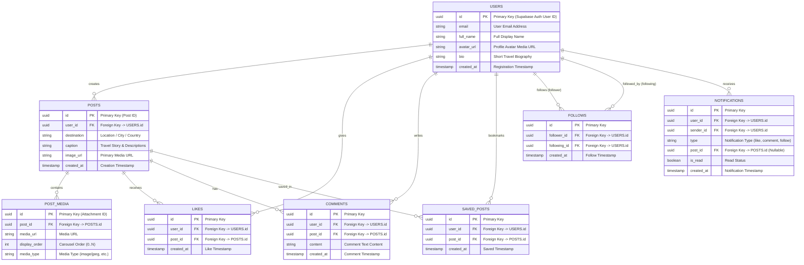

# TripNest 2.0 — Entity-Relationship (ER) Diagram

This document contains the complete database schema relationship model for **TripNest 2.0**.

---

## 📊 Database ER Diagram

---

## 🗄️ Entity Descriptions

1. **`USERS`**: Central user account entity linked with Supabase Authentication. Stores user profiles, display names, avatars, and bios.
2. **`POSTS`**: Core travel experience entity containing destination tags, captions, and primary image links.
3. **`POST_MEDIA`**: Supports multi-image carousels (up to 10 photos per post) with explicit display order.
4. **`LIKES`**: Junction table capturing likes given by users to travel posts.
5. **`COMMENTS`**: Contains user commentary on specific travel posts.
6. **`SAVED_POSTS`**: Junction table allowing users to bookmark posts into their personal travel collection.
7. **`FOLLOWS`**: Self-referencing social graph relationship table tracking followers and following relationships between users.
8. **`NOTIFICATIONS`**: Stores activity alerts triggered when users like, comment, or follow.
