# TripNest 2.0 — Entity-Relationship (ER) Diagram

This document contains the complete database schema relationship model and data dictionary for **TripNest 2.0**, backed by **Supabase PostgreSQL**.

---

## 📊 Database Entity-Relationship (ER) Diagram

```mermaid
erDiagram
    AUTH_USERS ||--|| PROFILES : "1:1 profile extension"
    AUTH_USERS ||--o{ POSTS : "creates (1:N)"
    AUTH_USERS ||--o{ LIKES : "gives (1:N)"
    AUTH_USERS ||--o{ COMMENTS : "writes (1:N)"
    AUTH_USERS ||--o{ SAVED_POSTS : "bookmarks (1:N)"
    AUTH_USERS ||--o{ FOLLOWS : "follower (1:N)"
    AUTH_USERS ||--o{ FOLLOWS : "following (1:N)"
    AUTH_USERS ||--o{ NOTIFICATIONS : "recipient (1:N)"
    AUTH_USERS ||--o{ NOTIFICATIONS : "actor (1:N)"
    AUTH_USERS ||--o{ STORAGE_OBJECTS : "owns media (1:N)"

    POSTS ||--o{ POST_MEDIA : "contains carousel items (1:N)"
    POSTS ||--o{ LIKES : "receives likes (1:N)"
    POSTS ||--o{ COMMENTS : "has discussion comments (1:N)"
    POSTS ||--o{ SAVED_POSTS : "saved in collections (1:N)"
    POSTS ||--o{ NOTIFICATIONS : "referenced in alerts (0..1:N)"

    AUTH_USERS {
        uuid id PK "Primary Key (Supabase Auth UID)"
        string email UK "User Email Address"
        timestamp created_at "Registration Timestamp"
        jsonb raw_user_meta_data "Metadata payload"
    }

    PROFILES {
        uuid id PK,FK "PK & FK -> auth.users(id) ON DELETE CASCADE"
        string email UK "User email address"
        string full_name "Full display name"
        string avatar_url "Profile avatar image URL"
        string bio "Short travel biography / description"
        timestamp created_at "Profile creation timestamp"
        timestamp updated_at "Last profile update timestamp"
    }

    POSTS {
        uuid id PK "Primary Key (Post UUID)"
        uuid user_id FK "FK -> auth.users(id) ON DELETE CASCADE"
        string image_url "Primary cover image URL"
        string destination "Travel destination / City / Country"
        string caption "Travel story, notes & caption"
        timestamp created_at "Post creation timestamp"
        timestamp updated_at "Last post edit timestamp"
    }

    POST_MEDIA {
        uuid id PK "Primary Key (Attachment UUID)"
        uuid post_id FK "FK -> public.posts(id) ON DELETE CASCADE"
        string media_url "Image / video media URL"
        string media_type "Media mime type (default: image)"
        int display_order "Carousel ordering index (0..N)"
        timestamp created_at "Uploaded timestamp"
    }

    FOLLOWS {
        uuid follower_id PK,FK "FK -> auth.users(id) ON DELETE CASCADE"
        uuid following_id PK,FK "FK -> auth.users(id) ON DELETE CASCADE"
        timestamp created_at "Follow timestamp"
    }

    LIKES {
        uuid user_id PK,FK "FK -> auth.users(id) ON DELETE CASCADE"
        uuid post_id PK,FK "FK -> public.posts(id) ON DELETE CASCADE"
        timestamp created_at "Like timestamp"
    }

    COMMENTS {
        uuid id PK "Primary Key (Comment UUID)"
        uuid user_id FK "FK -> auth.users(id) ON DELETE CASCADE"
        uuid post_id FK "FK -> public.posts(id) ON DELETE CASCADE"
        string content "Comment text content"
        timestamp created_at "Comment creation timestamp"
        timestamp updated_at "Last comment edit timestamp"
    }

    SAVED_POSTS {
        uuid user_id PK,FK "FK -> auth.users(id) ON DELETE CASCADE"
        uuid post_id PK,FK "FK -> public.posts(id) ON DELETE CASCADE"
        timestamp created_at "Saved bookmark timestamp"
    }

    NOTIFICATIONS {
        uuid id PK "Primary Key (Notification UUID)"
        uuid recipient_id FK "FK -> auth.users(id) ON DELETE CASCADE"
        uuid actor_id FK "FK -> auth.users(id) ON DELETE CASCADE"
        string type "Notification type (like, comment, follow)"
        uuid post_id FK "Nullable FK -> public.posts(id) ON DELETE CASCADE"
        boolean is_read "Read receipt status (default: false)"
        timestamp created_at "Notification trigger timestamp"
    }

    STORAGE_OBJECTS {
        uuid id PK "Storage Object UUID"
        string bucket_id "Bucket Identifier ('tripnest-media')"
        string name "Path in bucket (user_id/post_id/file)"
        uuid owner FK "FK -> auth.users(id)"
        timestamp created_at "Upload timestamp"
    }
```

---

## 🗄️ Detailed Data Dictionary

### 1. `auth.users` (Supabase Auth Core)
Managed internally by Supabase Auth service.
| Column | Type | Constraints | Description |
| :--- | :--- | :--- | :--- |
| `id` | `UUID` | `PRIMARY KEY` | Unique user identifier. |
| `email` | `VARCHAR` | `UNIQUE, NOT NULL` | Authenticated email address. |
| `created_at` | `TIMESTAMPTZ` | `DEFAULT NOW()` | Account creation time. |
| `raw_user_meta_data` | `JSONB` | `NULLABLE` | User metadata from registration (full name, avatar, bio). |

---

### 2. `public.profiles`
User profile extension synchronized via Postgres triggers (`handle_new_user`).
| Column | Type | Constraints | Description |
| :--- | :--- | :--- | :--- |
| `id` | `UUID` | `PRIMARY KEY, REFERENCES auth.users(id) ON DELETE CASCADE` | 1:1 foreign key mapping to Auth UID. |
| `email` | `TEXT` | `UNIQUE, NOT NULL` | User email address. |
| `full_name` | `TEXT` | `NULLABLE` | Display name of the traveler. |
| `avatar_url` | `TEXT` | `NULLABLE` | Direct URL to avatar image in media storage. |
| `bio` | `TEXT` | `NULLABLE` | Bio / travel tagline. |
| `created_at` | `TIMESTAMPTZ` | `DEFAULT NOW()` | Record creation timestamp. |
| `updated_at` | `TIMESTAMPTZ` | `DEFAULT NOW()` | Record update timestamp (auto-updated by trigger). |

---

### 3. `public.posts`
Core travel experience entity for shared stories and destination moments.
| Column | Type | Constraints | Description |
| :--- | :--- | :--- | :--- |
| `id` | `UUID` | `PRIMARY KEY, DEFAULT gen_random_uuid()` | Unique post identifier. |
| `user_id` | `UUID` | `NOT NULL, REFERENCES auth.users(id) ON DELETE CASCADE` | Creator of the travel post. |
| `image_url` | `TEXT` | `NOT NULL` | Primary / cover photo URL. |
| `caption` | `TEXT` | `NULLABLE` | Story description, travel notes, or tags. |
| `destination` | `TEXT` | `NULLABLE` | Location tag (e.g., "Kyoto, Japan", "Santorini, Greece"). |
| `created_at` | `TIMESTAMPTZ` | `DEFAULT NOW()` | Timestamp when the post was published. |
| `updated_at` | `TIMESTAMPTZ` | `DEFAULT NOW()` | Timestamp of last modification. |

---

### 4. `public.post_media`
Child entity enabling multi-photo carousel support (up to 10 images per post).
| Column | Type | Constraints | Description |
| :--- | :--- | :--- | :--- |
| `id` | `UUID` | `PRIMARY KEY, DEFAULT gen_random_uuid()` | Unique media attachment identifier. |
| `post_id` | `UUID` | `NOT NULL, REFERENCES public.posts(id) ON DELETE CASCADE` | Parent travel post reference. |
| `media_url` | `TEXT` | `NOT NULL` | Hosted image or media asset URL. |
| `media_type` | `TEXT` | `DEFAULT 'image'` | Media type indicator (`image`, `video`). |
| `display_order` | `INT` | `DEFAULT 0` | 0-indexed sorting position in carousel. |
| `created_at` | `TIMESTAMPTZ` | `DEFAULT NOW()` | Upload timestamp. |

---

### 5. `public.follows`
Social graph connection table managing follower-following relationships.
| Column | Type | Constraints | Description |
| :--- | :--- | :--- | :--- |
| `follower_id` | `UUID` | `NOT NULL, REFERENCES auth.users(id) ON DELETE CASCADE` | The user initiating the follow. |
| `following_id` | `UUID` | `NOT NULL, REFERENCES auth.users(id) ON DELETE CASCADE` | The user being followed. |
| `created_at` | `TIMESTAMPTZ` | `DEFAULT NOW()` | Follow action timestamp. |
| *Composite PK* | `(follower_id, following_id)` | `PRIMARY KEY` | Enforces single follow link between two users. |
| *Check Constraint* | `chk_not_self_follow` | `CHECK (follower_id <> following_id)` | Prevents self-following. |

---

### 6. `public.likes`
Engagement table recording post likes.
| Column | Type | Constraints | Description |
| :--- | :--- | :--- | :--- |
| `user_id` | `UUID` | `NOT NULL, REFERENCES auth.users(id) ON DELETE CASCADE` | User who liked the post. |
| `post_id` | `UUID` | `NOT NULL, REFERENCES public.posts(id) ON DELETE CASCADE` | Target post. |
| `created_at` | `TIMESTAMPTZ` | `DEFAULT NOW()` | Like timestamp. |
| *Composite PK* | `(user_id, post_id)` | `PRIMARY KEY` | Ensures idempotent 1-like-per-user-per-post. |

---

### 7. `public.comments`
Discussion comments attached to travel posts.
| Column | Type | Constraints | Description |
| :--- | :--- | :--- | :--- |
| `id` | `UUID` | `PRIMARY KEY, DEFAULT gen_random_uuid()` | Unique comment identifier. |
| `user_id` | `UUID` | `NOT NULL, REFERENCES auth.users(id) ON DELETE CASCADE` | Author of the comment. |
| `post_id` | `UUID` | `NOT NULL, REFERENCES public.posts(id) ON DELETE CASCADE` | Target travel post. |
| `content` | `TEXT` | `NOT NULL, CHECK (char_length(trim(content)) > 0)` | Comment message body. |
| `created_at` | `TIMESTAMPTZ` | `DEFAULT NOW()` | Comment post timestamp. |
| `updated_at` | `TIMESTAMPTZ` | `DEFAULT NOW()` | Comment edit timestamp. |

---

### 8. `public.saved_posts`
Personal bookmarks allowing travelers to save itineraries and inspirations.
| Column | Type | Constraints | Description |
| :--- | :--- | :--- | :--- |
| `user_id` | `UUID` | `NOT NULL, REFERENCES auth.users(id) ON DELETE CASCADE` | User saving the post. |
| `post_id` | `UUID` | `NOT NULL, REFERENCES public.posts(id) ON DELETE CASCADE` | Saved post reference. |
| `created_at` | `TIMESTAMPTZ` | `DEFAULT NOW()` | Saved timestamp. |
| *Composite PK* | `(user_id, post_id)` | `PRIMARY KEY` | Enforces single bookmark per user per post. |

---

### 9. `public.notifications`
In-app activity alerts for social engagement triggers.
| Column | Type | Constraints | Description |
| :--- | :--- | :--- | :--- |
| `id` | `UUID` | `PRIMARY KEY, DEFAULT gen_random_uuid()` | Unique notification identifier. |
| `recipient_id` | `UUID` | `NOT NULL, REFERENCES auth.users(id) ON DELETE CASCADE` | User receiving the notification. |
| `actor_id` | `UUID` | `NOT NULL, REFERENCES auth.users(id) ON DELETE CASCADE` | User who triggered the activity. |
| `type` | `TEXT` | `NOT NULL` | Event type: `'like'`, `'comment'`, `'follow'`. |
| `post_id` | `UUID` | `NULLABLE, REFERENCES public.posts(id) ON DELETE CASCADE` | Target post reference (if applicable). |
| `is_read` | `BOOLEAN` | `DEFAULT FALSE` | Read / unread status indicator. |
| `created_at` | `TIMESTAMPTZ` | `DEFAULT NOW()` | Event generation timestamp. |

---

### 10. `storage.objects` (`tripnest-media`)
Supabase Object Storage for travel photos and media assets.
| Column | Type | Constraints | Description |
| :--- | :--- | :--- | :--- |
| `id` | `UUID` | `PRIMARY KEY` | Storage object unique ID. |
| `bucket_id` | `TEXT` | `DEFAULT 'tripnest-media'` | Public bucket name for travel assets. |
| `name` | `TEXT` | `NOT NULL` | Storage key path (`avatars/{userId}/...` or `posts/{postId}/...`). |
| `owner` | `UUID` | `REFERENCES auth.users(id)` | User who uploaded the object. |
| `created_at` | `TIMESTAMPTZ` | `DEFAULT NOW()` | Upload timestamp. |

---

## ⚡ Database Indexes & Performance Optimization

| Index Name | Target Table | Indexed Column(s) | Purpose / Query Optimization |
| :--- | :--- | :--- | :--- |
| `idx_posts_created_at` | `public.posts` | `created_at DESC` | High-speed global chronological discovery feed query. |
| `idx_posts_user_created` | `public.posts` | `user_id, created_at DESC` | Traveler profile grid gallery retrieval. |
| `idx_posts_destination` | `public.posts` | `destination` | Destination-based search and filter autocomplete. |
| `idx_profiles_full_name` | `public.profiles` | `full_name` | User discovery and traveler search index. |
| `idx_likes_post_id` | `public.likes` | `post_id` | Instant like counts and user like checks per post. |
| `idx_comments_post_id` | `public.comments` | `post_id` | Fast comment threads loading under posts. |
| `idx_follows_follower_id` | `public.follows` | `follower_id` | "Following" list retrieval and personalized feed generation. |
| `idx_follows_following_id` | `public.follows` | `following_id` | "Followers" list and social count calculations. |
| `idx_saved_posts_user_id` | `public.saved_posts` | `user_id` | User "Saved Collections" tab loading. |
| `idx_notifications_recipient_id` | `public.notifications` | `recipient_id, created_at DESC` | Real-time notification inbox and unread badges. |

---

## 🛡️ Security & Row Level Security (RLS) Rules

- **`profiles`**: Public `SELECT` for authenticated users; `UPDATE` restricted to owner (`auth.uid() = id`).
- **`posts`**: Public `SELECT` for authenticated users; `INSERT`/`UPDATE`/`DELETE` restricted to owner (`auth.uid() = user_id`).
- **`post_media`**: `SELECT` open to authenticated users; `INSERT`/`DELETE` allowed only if the parent `posts.user_id = auth.uid()`.
- **`follows`**: `SELECT` open to authenticated users; `INSERT`/`DELETE` restricted to the actor (`auth.uid() = follower_id`).
- **`likes`**: `SELECT` open to authenticated users; `INSERT`/`DELETE` restricted to owner (`auth.uid() = user_id`).
- **`comments`**: `SELECT` open to authenticated users; `INSERT`/`DELETE` restricted to comment author (`auth.uid() = user_id`).
- **`saved_posts`**: Private `SELECT`/`INSERT`/`DELETE` restricted strictly to owner (`auth.uid() = user_id`).
- **`notifications`**: Private `SELECT`/`UPDATE` restricted to recipient (`auth.uid() = recipient_id`); `INSERT` restricted to actor (`auth.uid() = actor_id`).
