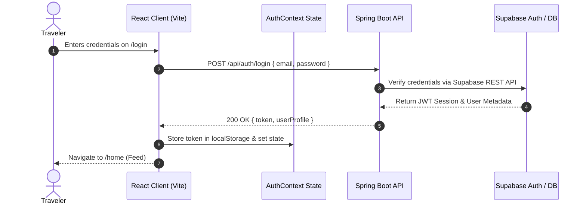
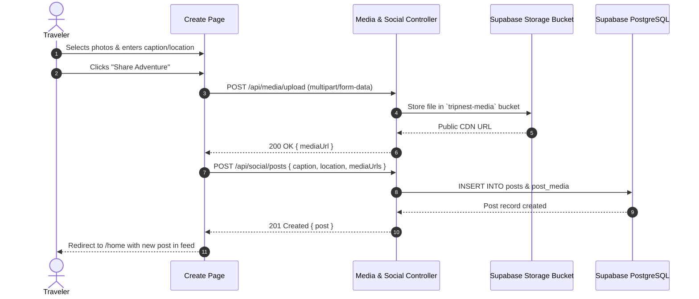
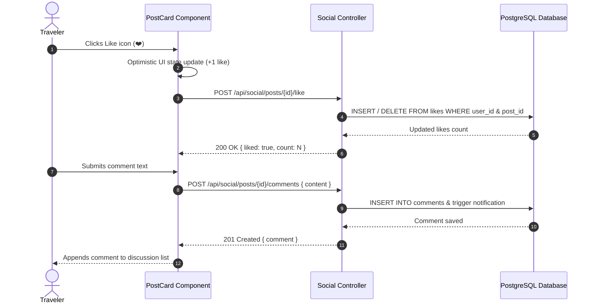

# TripNest 2.0 - System Sequence Diagrams

This document contains Mermaid sequence diagrams illustrating the primary runtime interaction flows across the Client (Vite React), Backend API (Spring Boot), and Supabase PostgreSQL / Storage.

---

## 1. Authentication & Session Initialization Flow

---

## 2. Post Creation & Media Upload Flow

---

## 3. Social Interaction (Like & Comment) Flow

